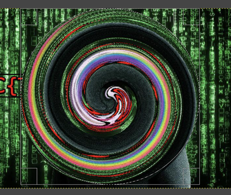
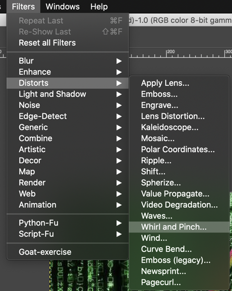

# Wanted
After staring at the image for a little while, it was clear that the image had
some kind of reversible distortion. So, first of all, we tried to identify what
type of distortion we were dealing with. 

We started googling some terms like:
  * Vortex image distortion.
  * Winding image distortion.
  * Twirl image distortion.

After some unsuccessful searches, we found [this
blog](http://matzjb.se/2015/07/26/deconstructing-swirl-face/) when searching
for "swirl image distortion". It is a blog about how a pedophile tried to hide
his face using the same type of distortion that appears on the challenge.
Luckily for us (and unluckily for the pedophile), this type of distortion is
reversible to a degree. The blog showcases this technique using photoshop.

Since we did not have photoshop available, we started playing with the image
using **Gimp**, which has "Whirl and Pinch" distortion under Filters ->
Distorts.

This is the original image:  

We can start by making a selection around the affected portion of the image by using the ellipse select tool.  
 

The trial and error comes into play now.  I'm not sure if the image is fully recoverable, but image needs to be focused on in sections rather than trying to undo the image as a whole.  When I first started working on the image I used a negative swirl to undo most of the outter edges and slowly worked my way to the center.  Depending on your selection of the image your settings of the tool may vary, but the end result is the same.  Below is an example of my selection and tool settings to get a large part of the image visible.  Some guess work was required to get the correct characters for the flag.  
Once a section of the image was where I needed it to be I created a new layer with that selection and locked it so it could not be altered by further use of the Whirl tool.  Unfortunately I no longer have my final version of the image, but this is a close version of it.    

After a bit of guesswork, we come to the conclusion the flag is:
TMHC{Th1sIsY0u1sntIt}
